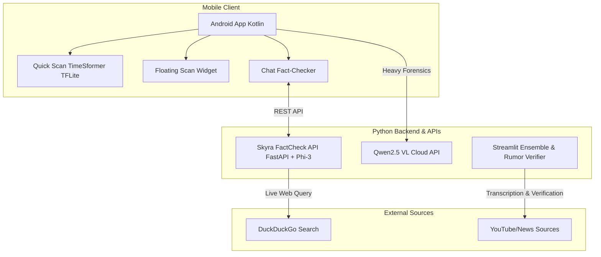

<div align="center">
  
  <h1>👁️ TruthSeeker</h1>
  <p><b>Advanced Deepfake Detection & AI-Powered Fact-Checking Ecosystem</b></p>
  <p>
    
    
    
    
  </p>
</div>

---

## 📖 Overview

**TruthSeeker** is a comprehensive, multi-modal application designed to detect synthetic media (deepfakes) and verify the authenticity of digital rumors. Built as a collaborative project, it leverages a hybrid **Edge + Cloud AI architecture** inspired by the state-of-the-art **Skyra** methodology. 

By utilizing local optimized models for rapid inference and powerful cloud Vision-Language Models (VLMs) like Qwen2.5 VL for explainable "Chain of Thought" reasoning, TruthSeeker provides users with fast, reliable, and interpretable forensic analysis of modern media.

---

## ✨ Key Features

### 📱 Android Edge Client
*   **Quick Local Scan**: Uses a quantized `TimeSformer` (Divided Space-Time Attention) running on CPU via TFLite (XNNPack) to instantly detect anomalies in video frames.
*   **Cloud Deep Forensics**: Sends complex media to a deployed Qwen2.5 VL model for heavy Chain-of-Thought (CoT) reasoning to provide detailed explanations for its verdicts (e.g., pointing out shape distortion, unnatural object appearance).
*   **Screen Capture Widget**: A floating overlay service that allows users to seamlessly scan media while browsing social platforms without needing to download files.

### 🕵️‍♂️ Fact-Checking Microservices
*   **Skyra Phi-3 Fact-Checker**: A local FastAPI service running a quantized `Phi-3-mini` LLM on CPU. It performs real-time web searches via DuckDuckGo to verify claims and returns a True/False/Misleading verdict with evidence.
*   **Rumor Verifier (Whisper)**: A Streamlit dashboard that transcribes YouTube news clips using local `Whisper` and utilizes `Gemini-1.5-Flash` to cross-reference statements with reputed news sources, plotting the results on a timeline.

### 🧠 Deepfake Detection Ensembles
*   **Spatial Model**: A custom PyTorch CNN with spatial attention designed to focus on high-frequency blending artifacts and texture jittering.
*   **Temporal Model**: An adapted `TimeSformer` fine-tuned to catch unnatural physics and motion inconsistencies over video sequences.

---

## 🏗️ System Architecture



---

## 📂 Project Structure

| Directory / File | Description |
| :--- | :--- |
| 📱 `kotlearn/` | The main Android Studio project containing the Kotlin application. |
| 🕵️ `factcheck/` | Python FastAPI backend utilizing `Phi-3-mini-4k-instruct-q4.gguf` for local fact-checking. |
| 🎙️ `wisper/` | Streamlit app (`app1.py`) for transcribing and verifying rumors using Whisper & Gemini. |
| 👁️ `ensemble/` | PyTorch spatial model definition (`spatial_model.py`) and its Streamlit inference UI. |
| ⏳ `modelly/Edge/` | Temporal video model logic (`tmodel.py`) utilizing Facebook's TimeSformer. |

---

## 🚀 Getting Started

### 1. Android App Setup
1. Open the `kotlearn` folder in **Android Studio**.
2. Ensure you have the required `lip_flex.tflite` model placed in the `assets/` folder.
3. Sync Gradle and run the app on a physical device or emulator (API 26+).

### 2. Local Fact-Check API Setup
To enable the AI Fact-Checker within the Android app:
```bash
cd factcheck
python -m venv venv2
source venv2/bin/activate  # (or venv2\Scripts\activate on Windows)
pip install fastapi uvicorn llama-cpp-python duckduckgo-search
```
*Ensure you download `Phi-3-mini-4k-instruct-q4.gguf` and place it in `factcheck/models/`.*
```bash
python app1.py
```
*The API will start on `0.0.0.0:8000`, making it accessible to the Android app on the same network.*

---

## 🔬 Methodology & The Skyra Inspiration

This project draws heavy inspiration from the **Skyra** methodology for AI-generated video detection. Instead of relying solely on binary classification, the architecture emphasizes **Grounded Artifact Reasoning**:
1.  **Low-Level Forgery Detection**: Identifying texture anomalies, unnatural blur, and color over-saturation.
2.  **Violation of Laws**: Utilizing VLMs to detect object inconsistency (e.g., sudden appearances), shape distortion, and violation of physical laws (e.g., impossible rigid-body crossing).
3.  **Explainability**: Providing users with clear, step-by-step reasoning (Chain-of-Thought) about *why* a piece of media is flagged as synthetic.

---
<div align="center">
  <i>Built to ensure truth and transparency in the era of Generative AI.</i>
</div>
